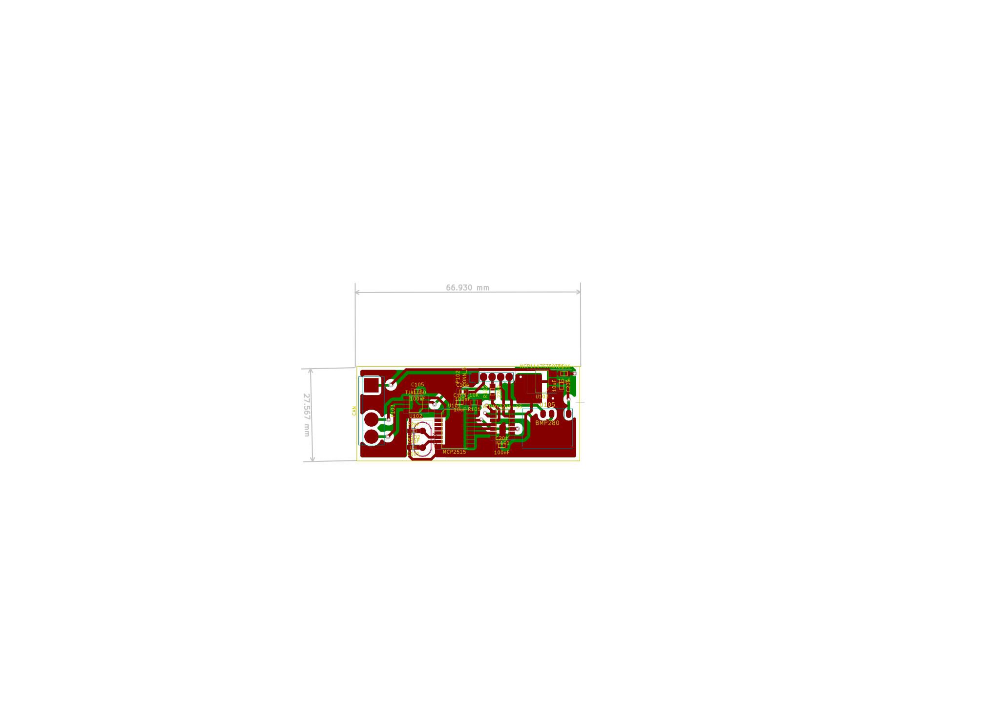
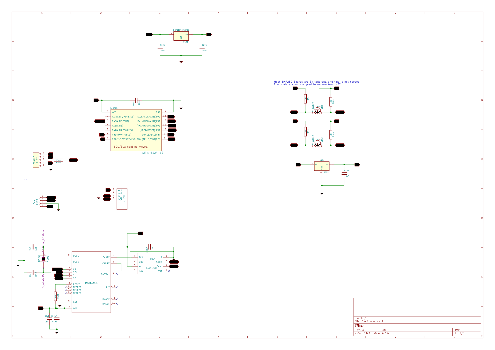

# Can Pressure sender

* Emits PGN  130310L  Outside Environmental parameters and 130311L Environmental parameters with temperature, pressure, humidity from a BME280 sensor.
* Draws about 10-15mA. Uses a Attiny3224, MCP2551 CAN, and TJ1050.
* Attiny runs at 16MHz, but could almost certainly run slower for lower power consumption.
* PCB in pcb/ measures 66mmx27mm and is powered by 12v from NMEA2000 bus, 5V via a AMS1117, BMP280 module has its own 622K 3v regulator and level shifters.
* Needs a UDPI Programmer (I am using a UNO based programmer)
* Header for TTL Serial debugging using single character command line input.

# Pins and Layout

    -------------------------------------------
    |             a b c d e                   |
    | A                             AMS1117   |
    | B  TJ1050                               |
    | C                   ATTiny              |
    | D        MCP2551    3224       BME280   |
    |                                         |
    -------------------------------------------

    Debug and Programming Header
    a GND
    b 5V
    c UDPI
    d RX
    e TX

    NMEA2000 Interface
    A 12V
    B GND
    C CanL
    D CanH

# Command line on TTL

    Battery Monitor - key presses
        - 'h' or '?' to show this message
        - 's' show status
        - 'd' toggle diagnostics
        - 'r' read sensor
        - 'S' setup
        - 'R' reset
        - 'F' factory reset

* R will cause the Attiny to reboot.
* S enters setup allowing some EEPROM parameters to be set 
* F resets the EEPROM to the Factory settings
* r reads the sensors and dumps to serial.
* d toggles disagnostic output which includes CAN Frame data 
* s reports current status including packet counts, MCP Volatage and temperature.

# Developing

* Uses PlatformIO in VSCode
* Before flashing for the first time set the fuses to ensure that the chip has the correct clock. `pio run -t fuses`
* To build `pio run -t upload`